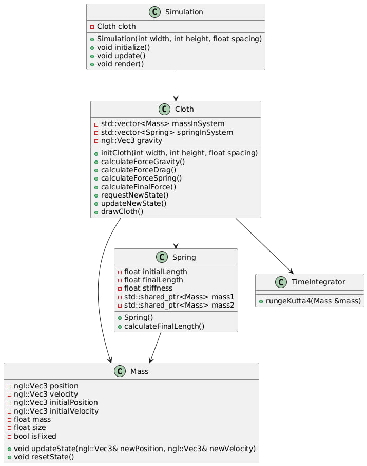

# Particle System Cloth Simulation (2D)

## Description

Develop a program to simulate cloth behavior using a particle system. The cloth is represented as a 2D grid of particles connected by springs and influenced by forces such as gravity. The objective is to model physical interactions between particles to mimic fabric dynamics realistically.

## Resources

- MIT course URL: https://ocw.mit.edu/courses/6-837-computer-graphics-fall-2012/
- Pikuma clothe simulation with Verlet integration: https://pikuma.com/blog/verlet-integration-2d-cloth-physics-simulation
- BlankNGL: https://github.com/NCCA/BlankNGL
- MassSpring / RK4 integrator: https://github.com/NCCA/MassSpring
- Particle structure: https://nccastaff.bournemouth.ac.uk/jmacey/msc/ase/labs/lab5/lab5/

## Computer animation area: Physical Based Animation

## Inputs
Optional parameters to toggle or control particle behavior, such as:
- Activating or deactivating forces like wind.
- Modifying the initial state and states affected by gravity.

## Output
A graphical application (OpenGL window) that visualizes the cloth simulation.

## Graphics API and Framework
- Graphics API: OpenGL
- Graphics Context: Qt
- Unit Testing Framework: GTest

## External libraries
- RK4 Integrator: Runge-Kutta 4th Order method (NCCA RK4 Application)
- NGL Library:
    * BlankNGL: For setting up the OpenGL window.
    * MassSpring Demo: For understanding physics concepts and incorporating RK4 integration.
- GTest: For unit testing.

## Mathematical Concepts
- **Ordinary Differential Equations (ODEs)**: Used to model the movement of particles over time.
- **Numerical Methods**: Runge-Kutta 4 (RK4) as the time integrator and also the Velvet integrator.
- **Physically-Based Animation**: Simulation of particle systems and interactions.
- **Physics**: Forces such as gravity, spring mechanics.
- **Note: Collission in particles can be a very difficult to handle so intial I will avoid this. **
- **Structural Mechanics**: Modeling particle grids to simulate material properties and forces within the system.

## Classes

### Mass
Represents a particle in the cloth. 

### Spring
Represents a spring connecting two particles.

### TimeIntegrator
Calculate the new velocty and position integrating the final force of any mass in the system

### Cloth
Handles the cloth simulation, including initialization, force calculations, state updates, and rendering.

### Simulation
Manages the simulation logic, integrating Cloth and NGLScene.

### NGLScene
Manages the OpenGL context and calls drawCloth to render the particles and springs.

### main
Initializes the Qt application, sets up the OpenGL format, initializes the simulation, and runs the main loop.

## UML Diagram

## Flowchart Description

1. Start: The application begins in main.
2. Initialize Application:
    2.1 main initializes the Qt application and sets up the OpenGL format.
    2.2 main initializes Simulation.
3. Simulation Logic:
    3.1 Simulation initializes Cloth and NGLScene.
    3.2 Simulation manages the main simulation loop.
4. Cloth Simulation:
    4.1 Cloth initializes Mass and Spring objects.
    4.2 Cloth calculates forces and updates states for the particles and springs.
    4.3 Cloth uses TimeIntegrator to compute new positions and velocities for masses.
5. Rendering:
    5.1 NGLScene calls drawCloth to render the particles and springs using OpenGL.
6. Repeat:
    6.1 This is repeat it until the cloth is in a equilirbium state. (total forces = 0)
