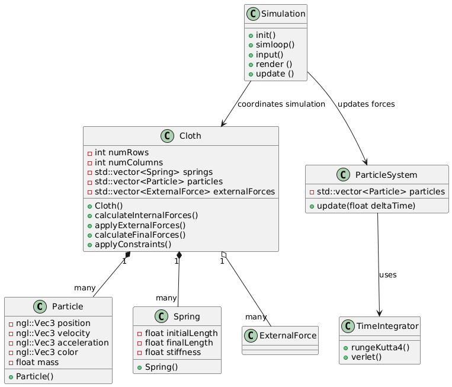

# Particle System Cloth Simulation (2D)

## Description

Develop a program to simulate cloth behavior using a particle system. The cloth is represented as a 2D grid of particles connected by springs and influenced by forces such as gravity. The objective is to model physical interactions between particles to mimic fabric dynamics realistically.

## Resources

- MIT course URL: https://ocw.mit.edu/courses/6-837-computer-graphics-fall-2012/
- Pikuma clothe simulation with Verlet integration: https://pikuma.com/blog/verlet-integration-2d-cloth-physics-simulation
- BlankNGL: https://github.com/NCCA/BlankNGL
- MassSpring / RK4 integrator: https://github.com/NCCA/MassSpring
- Particle structure: https://nccastaff.bournemouth.ac.uk/jmacey/msc/ase/labs/lab5/lab5/

## Computer animation area: Physical Based Animation

## Inputs
Optional parameters to toggle or control particle behavior, such as:
- Activating or deactivating forces like wind.
- Modifying the initial state and states affected by gravity.

## Output
A graphical application (OpenGL window) that visualizes the cloth simulation.

## Graphics API and Framework
- Graphics API: OpenGL
- Graphics Context: Qt (to develop the GUI)
- Unit Testing Framework: GTest

## External libraries
- RK4 Integrator: Runge-Kutta 4th Order method (NCCA RK4 Application)
- NGL Library:
    * BlankNGL: For setting up the OpenGL window.
    * MassSpring Demo: For understanding physics concepts and incorporating RK4 integration.
- GTest: For unit testing.

## Mathematical Concepts
- **Ordinary Differential Equations (ODEs)**: Used to model the movement of particles over time.
- **Numerical Methods**: Runge-Kutta 4 (RK4) as the time integrator and also the Velvet integrator.
- **Physically-Based Animation**: Simulation of particle systems and interactions.
- **Physics**: Forces such as gravity, spring mechanics.
- **Note: Collission in particles can be a very difficult to handle so intial I will avoid this. **
- **Structural Mechanics**: Modeling particle grids to simulate material properties and forces within the system.

## Classes

### Particle
This class is responsible for managing the individual properties of each particle such as position, velocity, acceleration, and mass, along with a color property to allow the user to choose a color for the grid (just for fun).

### Spring
TTe class represents the properties of a spring. The mass of this element is not taking in count cause the force will calculate it according to Hooke's law.

### ParticleSystem
This class is responsible for:

    - Store the initial and final state of the particles.
    - Request to the time integrator the final state of the particles.
    - Pass the final state to the render function in OpenGL.

### TimeIntegrator
The TimeIntegrator contains the implementation for the different numerical integrators used in the simulation. Im planning to use the Runge-Kutta 4th order (RK4) available in the NCCA. And if everything works well I will develope the Verlet integrator.

### Cloth
The Cloth class is responsible for calculating the internal and external forces between particles, managing the constraints that define the cloth's behavior, and calculating the final force acting on each particle.

### Simulation
Serves as the central controller of the simulation, managing the main simulation loop. It handles user input events, updates the simulation state by interacting with core components like the particle system and integrators, and manages the rendering of the simulation's current state. Additionally, it allows for switching between different numerical integrators and resetting the simulation as needed, coordinating the overall flow of the application to ensure smooth interaction and execution

## UML Diagram

## Workflow
 
