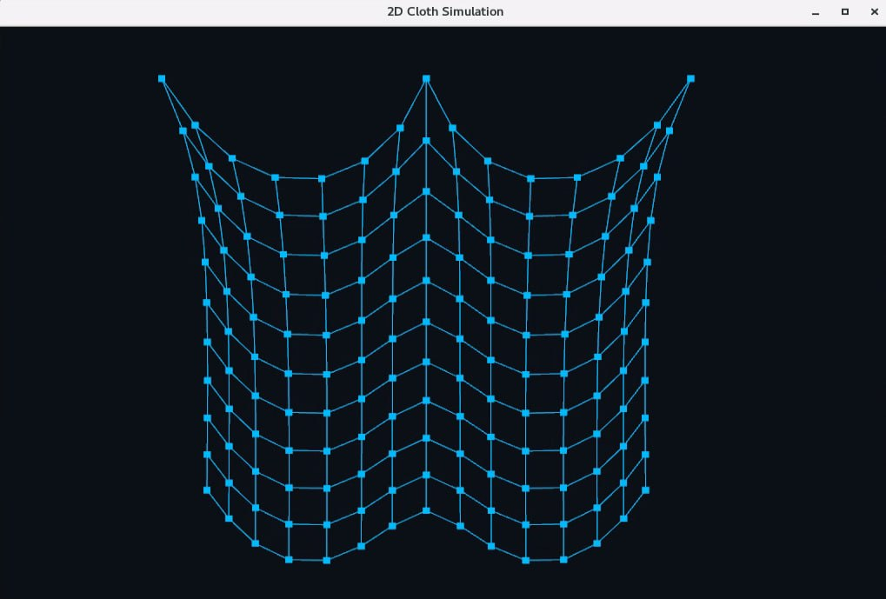

# Cloth Simulation Using Mass-Spring-Damper System 

## Description
Develop a program to simulate cloth behavior using the Mass-Spring-Damper approach. The cloth is represented as a 2D grid of point masses connected by springs and influenced by forces such as gravity. The objective is to model physical interactions between point masses to mimic fabric dynamics realistically.

## Resources
- MIT course URL: https://ocw.mit.edu/courses/6-837-computer-graphics-fall-2012/
- Pikuma cloth simulation with Verlet integration: https://pikuma.com/blog/verlet-integration-2d-cloth-physics-simulation
- BlankNGL: https://github.com/NCCA/BlankNGL
- MassSpring / RK4 integrator: https://github.com/NCCA/MassSpring
- Particle structure: https://nccastaff.bournemouth.ac.uk/jmacey/msc/ase/labs/lab5/lab5/

## Computer animation area
Physical Based Animation

## Output
A graphical application (OpenGL window) that visualizes the cloth simulation.

## Graphics API and Framework
- Graphics API: OpenGL
- Graphics Context: Qt
- Unit Testing Framework: GTest

## External libraries
- RK4 Integrator: Runge-Kutta 4th Order method (NCCA RK4 Application)
- NGL Library:
    * BlankNGL: For setting up the OpenGL window.
    * MassSpring Demo: For understanding physics concepts and incorporating RK4 integration.
- GTest: For unit testing.

## Mathematical Concepts
- **Ordinary Differential Equations (ODEs)**: Used to model the movement of the point masses over time.
- **Numerical Methods**: Runge-Kutta 4 (RK4) as the time integrator.
- **Physically-Based Animation**: Simulation of particle systems and interactions.
- **Physics**: Forces such as gravity, spring, damping and drag. ***Note:Collision detection was not implemented in this application.***
- **Structural Mechanics**: Modeling particle grids to simulate material properties and forces within the system.

## Dependencies 
Ensure that NGL is installed on your computer. You can find the installation instructions and more information here: NGL - The NCCA Graphics Library.: https://github.com/NCCA/NGL

## Installation and Build
1. Clone the repository:
    - git clone git@github.com:NCCA/programming-project-DanielaHz.git
2. Build the project:
    - Windows :- mkdir build; cd build ; cmake -DCMAKE_PREFIX_PATH=~/NGL/ .. ; cmake --build . 
    - Linux / Mac mkdir build; cd build; cmake -DCMAKE_PREFIX_PATH=~/NGL/ .. ; make

## Usage
1. Navigate to the build directory:
    - cd build
2. Run the program:
    - ./ClothSimulation
3. Run the unit tests:
    - ./ClothSimulationTests

## Classes

- **Mass**: Represents a points mass in the cloth. 
- **Spring**:Represents a spring connecting two particles.
- **TimeIntegrator**:Calculate the new velocty and position integrating the final force of all point masses in the system.
- **Cloth**:Handles the cloth simulation, including initialization, force calculations, state updates, and draw.
- **Simulation**:Manages the simulation logic, integrating Cloth and NGLScene.
- **NGLScene**:Manages the OpenGL context and calls drawCloth to render the particles and springs.
- **main**:Initializes the Qt application, sets up the OpenGL format, initializes the simulation, and runs the main loop.

## UML Diagram

